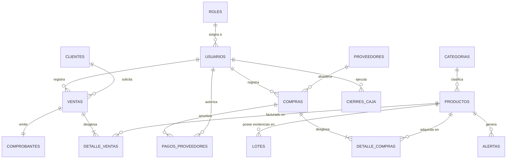

# MANUAL TÉCNICO DE SISTEMA
## AgroDesk - Sistema ERP y POS para Agroservicios Tejutla
**Versión del Documento:** 1.0.0  
**Fecha de Emisión:** Mayo 2026  
**Plataforma:** Next.js (App Router), React 19, Supabase SSR, PostgreSQL  

---

## ÍNDICE GENERAL

1. [INTRODUCCIÓN Y GENERALIDADES](#1-introducción-y-generalidades)
   - 1.1. Propósito del Manual Técnico
   - 1.2. Alcance del Sistema
   - 1.3. Limitaciones y Exclusiones
2. [ARQUITECTURA DEL SISTEMA](#2-arquitectura-del-sistema)
   - 2.1. Patrón Arquitectónico (App Router & Server Actions)
   - 2.2. Stack Tecnológico Detallado
   - 2.3. Estructura de Directorios del Código Fuente
3. [MODELO DE BASE DE DATOS](#3-modelo-de-base-de-datos)
   - 3.1. Diagrama Entidad-Relación (DER)
   - 3.2. Diccionario de Datos Exhaustivo
4. [MÓDULOS Y LÓGICA DE NEGOCIO](#4-módulos-y-lógica-de-negocio)
   - 4.1. Módulo de Inventario y Gestión de Lotes
   - 4.2. Módulo de Ventas y Descarga FIFO de Caducidades
   - 4.3. Módulo de Compras y Abastecimiento
   - 4.4. Control Financiero y Cierres de Caja
   - 4.5. Sistema de Alertas Automáticas
5. [SEGURIDAD Y PERSISTENCIA DE SESIÓN](#5-seguridad-y-persistencia-de-sesión)
   - 5.1. Autenticación y Gestión de Cookies de Sesión
   - 5.2. Row Level Security (RLS) en Supabase
   - 5.3. Intercepción y Middleware de Enrutamiento
6. [DESPLIEGUE, CONFIGURACIÓN Y OPERACIÓN](#6-despliegue-configuración-y-operación)
   - 6.1. Requisitos Previos y Entorno
   - 6.2. Instalación Local Paso a Paso
   - 6.3. Variables de Entorno
7. [MANTENIMIENTO Y RESOLUCIÓN DE PROBLEMAS](#7-mantenimiento-y-resolución-de-problemas)
   - 7.1. Guía de Solución de Errores Comunes (Troubleshooting)
   - 7.2. Glosario Técnico

---

## 1. INTRODUCCIÓN Y GENERALIDADES

### 1.1. Propósito del Manual Técnico
El presente documento constituye el **Manual Técnico Oficial** de la plataforma **AgroDesk**, desarrollada para la gestión operativa y administrativa de **Agroservicios Tejutla**. Su propósito primordial es proveer al equipo de ingeniería, administradores de sistemas y futuros desarrolladores una referencia exhaustiva sobre la arquitectura interna del software, el diseño relacional de la base de datos, los flujos algorítmicos transaccionales y las directrices para el mantenimiento y escalabilidad del código.

### 1.2. Alcance del Sistema
AgroDesk integra funcionalidades avanzadas de Planificación de Recursos Empresariales (ERP) con un Punto de Venta (POS) optimizado para el sector agrícola. El sistema abarca:
- **Gestión Estricta de Inventarios:** Trazabilidad completa de productos mediante control de lotes y fechas de caducidad.
- **Punto de Venta Transaccional:** Facturación ágil con descarga automática de existencias aplicando criterios FIFO (Primeras Entradas, Primeras Salidas) según proximidad de vencimiento.
- **Abastecimiento y Proveeduría:** Registro de compras, afectación de costos promedio e historial de pagos.
- **Control Financiero:** Conciliación de ingresos y egresos a través de cierres de caja diarios con cálculo automatizado de utilidad bruta.
- **Notificaciones Proactivas:** Monitoreo en segundo plano para la emisión de alertas tempranas sobre stock crítico y productos próximos a caducar.

### 1.3. Limitaciones y Exclusiones
Para acotar el alcance y garantizar un rendimiento óptimo en sus flujos críticos, la versión actual del sistema establece las siguientes delimitaciones:
- **Nóminas y RRHH:** No incluye módulos para la gestión de planillas, cálculo de horas extras ni prestaciones laborales.
- **Contabilidad Fiscal Avanzada:** No genera partidas contables complejas ni estados financieros de propósito general (Balances Generales, Estados de Resultados auditables); se enfoca estrictamente en el flujo de caja operativo.
- **Pasarela de Pagos Externa:** Al tratarse de un software POS para uso interno en mostrador, no expone integraciones con procesadores de tarjetas de crédito o pasarelas web para clientes finales (e-commerce).

---

## 2. ARQUITECTURA DEL SISTEMA

### 2.1. Patrón Arquitectónico (App Router & Server Actions)
AgroDesk implementa una arquitectura moderna basada en componentes y flujos de renderizado híbrido utilizando **Next.js 16+ con App Router**.
- **React Server Components (RSC):** La mayor parte de las vistas (como dashboards y listados) se renderizan nativamente en el servidor, eliminando la necesidad de enviar JavaScript innecesario al cliente y permitiendo consultas directas y seguras a la base de datos.
- **Server Actions:** Las mutaciones de datos (creación de ventas, actualización de stock, registros de usuarios) se gestionan mediante funciones asíncronas ejecutadas de forma nativa en el backend, garantizando que la lógica de validación y transaccionalidad ocurra en un entorno seguro antes de interactuar con Supabase.
- **Client Components:** Empleados estratégicamente en los nodos de la interfaz que requieren interactividad rica (formularios dinámicos, tablas con filtrado en tiempo real, modales y selectores de fechas).

### 2.2. Stack Tecnológico Detallado

| Capa / Componente | Tecnología Principal | Versión / Especificación | Propósito Técnico |
| :--- | :--- | :--- | :--- |
| **Framework Base** | Next.js | 16.1.6 | Enrutamiento, SSR/SSG, Server Actions y optimización global. |
| **Librería de UI** | React | 19.2.4 | Renderizado de componentes e interactividad. |
| **Estilos y Diseño** | Tailwind CSS | v4.2.0 | Motor de utilidades CSS de alto rendimiento. |
| **Sistema de Diseño** | shadcn/ui + Radix UI | Primitivas sin estilos | Componentes accesibles, altamente personalizables y modulares. |
| **Manejo de Formularios**| React Hook Form + Zod | 7.54.1 / 3.24.1 | Gestión de estados de entrada y validación estricta de esquemas. |
| **Base de Datos** | PostgreSQL (Supabase) | v15+ | Almacenamiento relacional, integridad referencial y RLS. |
| **Cliente Supabase** | `@supabase/ssr` | 0.10.0 | Gestión de sesiones SSR y sincronización segura de cookies. |
| **Iconografía** | Lucide React | 0.564.0 | Conjunto coherente de iconos vectoriales ligeros. |

### 2.3. Estructura de Directorios del Código Fuente

```text
AgroDesk/
├── app/
│   ├── (app)/                  # Grupo de rutas protegidas (Dashboard y Módulos)
│   │   ├── clientes/           # Gestión del directorio de clientes
│   │   ├── configuracion/      # Ajustes globales del sistema
│   │   ├── finanzas/           # Cierres de caja y pagos a proveedores
│   │   ├── inventario/         # Catálogo de productos, categorías y lotes
│   │   ├── movimientos/        # Historial de entradas y salidas de stock
│   │   ├── proveedores/        # Directorio y cuentas de proveedores
│   │   ├── reportes/           # Analítica y métricas de rendimiento
│   │   ├── usuarios/           # Administración de cuentas y roles RLS
│   │   ├── ventas/             # Terminal POS y registro transaccional
│   │   ├── page.tsx            # Dashboard principal (Métricas clave)
│   │   └── layout.tsx          # Estructura envolvente con Sidebar y Header
│   ├── (auth)/                 # Grupo de rutas públicas
│   │   └── login/              # Interfaz de autenticación
│   ├── actions/                # Lógica Backend (Server Actions invocables)
│   │   ├── clients.ts          # Mutaciones y consultas de clientes
│   │   ├── dashboard.ts        # Agregación de datos y KPIs de inicio
│   │   ├── finances.ts         # Operaciones de caja y egresos
│   │   ├── inventory.ts        # CRUD de productos y gestión de lotes
│   │   ├── purchases.ts        # Transacciones de abastecimiento
│   │   ├── reports.ts          # Generación de reportes SQL avanzados
│   │   ├── sales.ts            # Motor de facturación y descargas de stock
│   │   ├── settings.ts         # Preferencias operativas
│   │   ├── suppliers.ts        # Gestión de proveedores
│   │   └── users.ts            # Control de acceso y perfiles
│   ├── globals.css             # Capa base de Tailwind e inicialización CSS
│   └── layout.tsx              # Root Layout (Inyectores de contexto y temas)
├── components/                 # Bloques de construcción visuales
│   ├── ui/                     # Primitivas generadas por shadcn/ui (Botones, Tablas, etc.)
│   ├── app-shell.tsx           # Contenedor estructural del cliente
│   ├── app-sidebar.tsx         # Menú de navegación principal adaptable
│   ├── data-table.tsx          # Componente genérico para tablas de datos avanzadas
│   ├── page-header.tsx         # Encabezados estandarizados de sección
│   └── stat-card.tsx           # Tarjetas de indicadores clave (KPIs)
├── lib/
│   └── supabase/               # Capa de abstracción de datos y Auth
│       ├── admin.ts            # Cliente con privilegios elevados (Bypass RLS interno)
│       ├── client.ts           # Inicializador del cliente Supabase en el navegador
│       ├── middleware.ts       # Interceptor de peticiones para refresco de sesión
│       └── server.ts           # Inicializador del cliente Supabase en el servidor
└── types/
    └── database.ts             # Definiciones estáticas TypeScript de la BD generadas
```

---

## 3. MODELO DE BASE DE DATOS

### 3.1. Diagrama Entidad-Relación (DER)
La base de datos relacional garantiza la consistencia transaccional mediante restricciones estrictas de clave foránea y borrados en cascada controlados.



### 3.2. Diccionario de Datos Exhaustivo

#### Tabla: `roles`
Almacena los niveles de jerarquía del sistema para la gestión de permisos.
- `id_rol` (SERIAL, PK): Identificador único del rol.
- `nombre` (VARCHAR(50), NOT NULL): Denominación (ej. *Administrador*, *Vendedor*).

#### Tabla: `categorias`
Agrupaciones lógicas para la organización del catálogo de productos.
- `id_categoria` (SERIAL, PK): Identificador de la categoría.
- `nombre` (VARCHAR(100), NOT NULL): Nombre de la categoría.
- `descripcion` (TEXT, NULL): Detalles adicionales sobre el tipo de productos.

#### Tabla: `clientes`
Directorio de compradores para la emisión de facturas y seguimiento de créditos.
- `id_cliente` (SERIAL, PK): Clave primaria.
- `nit` (VARCHAR(20), UNIQUE, NULL): Número de Identificación Tributaria.
- `nombre` (VARCHAR(150), NOT NULL): Razón social o nombre completo.
- `direccion` (VARCHAR(255), NULL): Domicilio fiscal o de envío.
- `telefono` (VARCHAR(20), NULL): Número de contacto.
- `tipo_cliente` (VARCHAR(50), NULL): Clasificación (ej. *Mayorista*, *Final*).

#### Tabla: `proveedores`
Entidades comerciales que suministran los insumos agrícolas.
- `id_proveedor` (SERIAL, PK): Clave primaria.
- `nit` (VARCHAR(20), UNIQUE, NULL): Identificador fiscal del proveedor.
- `nombre` (VARCHAR(150), NOT NULL): Nombre comercial o razón social.
- `direccion` (VARCHAR(255), NULL): Ubicación principal.
- `telefono` (VARCHAR(20), NULL): Teléfono central.
- `contacto` (VARCHAR(150), NULL): Nombre del ejecutivo o representante directo.

#### Tabla: `usuarios`
Cuentas de acceso autorizadas para operar la plataforma.
- `id_usuario` (SERIAL, PK): Clave interna única.
- `nombre` (VARCHAR(150), NOT NULL): Nombre real del operador.
- `email` (VARCHAR(100), UNIQUE, NOT NULL): Correo electrónico (usuario de acceso).
- `password` (VARCHAR(255), NOT NULL): Hash criptográfico de la contraseña.
- `id_rol` (INT, FK -> `roles.id_rol`): Referencia al nivel de privilegios.

#### Tabla: `productos`
El catálogo central del inventario valorizado.
- `id_producto` (SERIAL, PK): Clave primaria.
- `codigo` (VARCHAR(50), UNIQUE, NOT NULL): Código de barras o SKU interno.
- `nombre` (VARCHAR(150), NOT NULL): Descripción comercial del insumo.
- `id_categoria` (INT, FK -> `categorias.id_categoria`, NULL): Categoría asignada.
- `precio_compra` (DECIMAL(10,2), NOT NULL): Costo base de adquisición.
- `precio_venta` (DECIMAL(10,2), NOT NULL): Precio unitario de salida al público.
- `stock_minimo` (INT, DEFAULT 0): Umbral inferior para disparar alertas de reposición.

#### Tabla: `lotes`
Estructura crítica para la trazabilidad y gestión de fechas de vencimiento.
- `id_lote` (SERIAL, PK): Identificador único del lote de entrada.
- `id_producto` (INT, FK -> `productos.id_producto`): Producto al que pertenece.
- `numero_lote` (VARCHAR(50), NOT NULL): Código alfanumérico impreso por el fabricante.
- `fecha_vencimiento` (DATE, NULL): Fecha límite de viabilidad del producto.
- `stock_actual` (INT, DEFAULT 0): Existencias remanentes físicamente en este lote específico.

#### Tabla: `ventas`
Cabecera de las transacciones comerciales de salida.
- `id_venta` (SERIAL, PK): Folio interno de la venta.
- `id_cliente` (INT, FK -> `clientes.id_cliente`, NULL): Comprador asociado.
- `id_usuario` (INT, FK -> `usuarios.id_usuario`, NULL): Vendedor que procesó la orden.
- `fecha` (TIMESTAMP, DEFAULT CURRENT_TIMESTAMP): Sello temporal exacto.
- `total` (DECIMAL(10,2), NOT NULL): Sumatoria monetaria final cobrada.
- `estado` (VARCHAR(20), DEFAULT 'Completada'): Estado lógico (*Completada*, *Anulada*).

#### Tabla: `detalle_ventas`
Líneas de desglose por cada artículo facturado en una venta.
- `id_detalle_venta` (SERIAL, PK): Clave de la línea.
- `id_venta` (INT, FK -> `ventas.id_venta`, ON DELETE CASCADE): Venta padre.
- `id_producto` (INT, FK -> `productos.id_producto`, NULL): Artículo vendido.
- `cantidad` (INT, NOT NULL): Unidades despachadas.
- `precio_unitario` (DECIMAL(10,2), NOT NULL): Precio pactado en el momento de la transacción.
- `subtotal` (DECIMAL(10,2), NOT NULL): Resultado de `cantidad * precio_unitario`.

#### Tabla: `compras`
Cabecera de recepciones de mercadería y abastecimiento.
- `id_compra` (SERIAL, PK): Folio interno de entrada.
- `id_proveedor` (INT, FK -> `proveedores.id_proveedor`, NULL): Suministrador.
- `id_usuario` (INT, FK -> `usuarios.id_usuario`, NULL): Operador que recepcionó.
- `fecha` (TIMESTAMP, DEFAULT CURRENT_TIMESTAMP): Sello temporal del ingreso.
- `numero_factura` (VARCHAR(50), NULL): Documento físico emitido por el proveedor.
- `total` (DECIMAL(10,2), NOT NULL): Monto total facturado por el proveedor.

#### Tabla: `detalle_compras`
Líneas de insumos ingresados en una orden de compra.
- `id_detalle_compra` (SERIAL, PK): Clave de la línea.
- `id_compra` (INT, FK -> `compras.id_compra`, ON DELETE CASCADE): Compra padre.
- `id_producto` (INT, FK -> `productos.id_producto`, NULL): Insumo recepcionado.
- `cantidad` (INT, NOT NULL): Volumen ingresado.
- `precio_unitario` (DECIMAL(10,2), NOT NULL): Costo de adquisición individual pactado.
- `subtotal` (DECIMAL(10,2), NOT NULL): Importe neto de la línea.

#### Tabla: `alertas`
Registro de notificaciones del sistema generadas automáticamente.
- `id_alerta` (SERIAL, PK): Clave primaria.
- `id_producto` (INT, FK -> `productos.id_producto`, NULL): Producto con incidencia.
- `tipo_alerta` (VARCHAR(50), NOT NULL): Categorización (*Stock Mínimo*, *Próximo a Vencer*).
- `descripcion` (TEXT, NOT NULL): Mensaje detallado para el usuario.
- `fecha_creacion` (TIMESTAMP, DEFAULT CURRENT_TIMESTAMP): Instante de detección.
- `estado` (VARCHAR(20), DEFAULT 'Activa'): Seguimiento operativo (*Activa*, *Resuelta*).

#### Tabla: `cierres_caja`
Consolidación diaria o por turno para arqueo financiero.
- `id_cierre` (SERIAL, PK): Folio del corte de caja.
- `id_usuario` (INT, FK -> `usuarios.id_usuario`, NULL): Responsable de la caja.
- `fecha_cierre` (TIMESTAMP, DEFAULT CURRENT_TIMESTAMP): Momento de finalización.
- `total_ventas` (DECIMAL(10,2), DEFAULT 0.00): Total ingresado en mostrador.
- `total_egresos` (DECIMAL(10,2), DEFAULT 0.00): Sumatoria de salidas autorizadas.
- `utilidad_bruta` (DECIMAL(10,2), DEFAULT 0.00): Margen operativo bruto estimado.
- `saldo_final` (DECIMAL(10,2), NOT NULL): Efectivo real remanente en caja.
- `observaciones` (TEXT, NULL): Anotaciones sobre discrepancias o retiros.

#### Tabla: `pagos_proveedores`
Registro transaccional de egresos destinados a saldar deudas de compras.
- `id_pago` (SERIAL, PK): Folio del recibo de egreso.
- `id_compra` (INT, FK -> `compras.id_compra`, NULL): Factura de proveedor que se abona.
- `id_usuario` (INT, FK -> `usuarios.id_usuario`, NULL): Usuario que entrega el pago.
- `fecha_pago` (TIMESTAMP, DEFAULT CURRENT_TIMESTAMP): Sello temporal.
- `monto_pagado` (DECIMAL(10,2), NOT NULL): Valor del desembolso.
- `metodo_pago` (VARCHAR(50), NOT NULL): Vía (*Efectivo*, *Transferencia*, *Cheque*).
- `referencia` (VARCHAR(100), NULL): Número de cheque o código de rastreo bancario.

#### Tabla: `comprobantes`
Documentos con validez operativa vinculados uno a uno con las ventas.
- `id_comprobante` (SERIAL, PK): Clave primaria.
- `id_venta` (INT, FK -> `ventas.id_venta`, ON DELETE CASCADE): Transacción mercantil asociada.
- `tipo_comprobante` (VARCHAR(50), NOT NULL): Modalidad (*Factura*, *Ticket de Caja*).
- `serie` (VARCHAR(10), NULL): Serie preimpresa o digital.
- `correlativo` (VARCHAR(50), UNIQUE, NOT NULL): Número consecutivo único global.
- `fecha_emision` (TIMESTAMP, DEFAULT CURRENT_TIMESTAMP): Sello de expedición.

---

## 4. MÓDULOS Y LÓGICA DE NEGOCIO

### 4.1. Módulo de Inventario y Gestión de Lotes
El inventario no consolida existencias en un único campo entero dentro de la tabla `productos`. En su lugar, el stock disponible de un producto es un campo calculado dinámicamente que representa la suma de la columna `stock_actual` de todos los registros activos en la tabla vinculada `lotes` (`WHERE stock_actual > 0`).
- **Creación de Producto:** Registra metadatos base y establece umbrales de stock mínimo.
- **Asignación Inicial:** Todo inventario físico ingresa obligatoriamente con un código de lote y una fecha de vencimiento declarada.

### 4.2. Módulo de Ventas y Descarga FIFO de Caducidades
El núcleo transaccional del sistema reside en el algoritmo implementado en `app/actions/sales.ts`. Cuando se confirma un carrito de compras en el POS, el backend ejecuta el siguiente flujo lógico de forma atómica:

1. **Validación Previa:** Se verifica que la sumatoria de stock en los lotes del insumo sea mayor o igual a la cantidad solicitada.
2. **Creación de Cabecera:** Se inserta el registro maestro en `ventas` y se pre-reserva el correlativo en `comprobantes`.
3. **Iteración de Descarga (Algoritmo FIFO por Caducidad):**
   Para cada artículo del detalle, el motor consulta los lotes asociados ordenados cronológicamente por `fecha_vencimiento ASC` (los más viejos o próximos a caducar primero).
   ```text
   Mientras Cantidad_Faltante > 0:
      Obtener Lote_Actual (más próximo a vencer con stock > 0)
      Si Lote_Actual.stock_actual >= Cantidad_Faltante:
         Restar Cantidad_Faltante de Lote_Actual.stock_actual
         Cantidad_Faltante = 0
      Sino:
         Cantidad_Faltante = Cantidad_Faltante - Lote_Actual.stock_actual
         Establecer Lote_Actual.stock_actual = 0
      Guardar actualización del Lote en base de datos
   ```
4. **Inserción de Líneas:** Se escriben los registros finales en `detalle_ventas`.

### 4.3. Módulo de Compras y Abastecimiento
Gestiona la adición de activos al inventario mediante la interfaz de compras.
- **Ingreso de Factura:** Al recibir insumos de un proveedor, el usuario detalla los productos, costos unitarios de entrada, número de lote físico y fechas de caducidad.
- **Impacto Interno:** El sistema genera registros independientes en la tabla `lotes`. Si un lote con el mismo código alfanumérico y fecha ya existe para dicho producto, incrementa su `stock_actual`; en caso contrario, instancia un nuevo registro para preservar la separación estricta de trazabilidad.

### 4.4. Control Financiero y Cierres de Caja
Garantiza el monitoreo de flujos de efectivo en el mostrador.
- **Apertura y Flujo:** Todas las transacciones de ventas en estado *Completada* incrementan el acumulado de ingresos. Los pagos a proveedores registrados a través de `pagos_proveedores` se contabilizan como egresos líquidos.
- **Algoritmo de Cierre:** Invocado desde `app/actions/finances.ts`, calcula:
  $$\text{Saldo Final Calculado} = \sum \text{Ventas del Turno} - \sum \text{Egresos Registrados}$$
  Adicionalmente, aproxima la utilidad bruta restando del total vendido el costo base de los productos despachados según su `precio_compra` histórico.

### 4.5. Sistema de Alertas Automáticas
Un proceso de evaluación continua (o disparado tras cada mutación de stock/compras) verifica la salud del inventario.
- **Regla de Stock Crítico:** Inyecta un registro en `alertas` si $\sum \text{stock\_actual} \le \text{stock\_minimo}$.
- **Regla de Caducidad:** Inyecta un registro de alerta si un lote activo posee `fecha_vencimiento` dentro de un umbral predefinido (ej. inferior a 30 días calendario respecto a la fecha actual).

---

## 5. SEGURIDAD Y PERSISTENCIA DE SESIÓN

### 5.1. Autenticación y Gestión de Cookies de Sesión
Para satisfacer estrictos requerimientos de privacidad y seguridad en mostradores compartidos, AgroDesk implementa una **Persistencia de Sesión Basada Exclusivamente en Memoria del Navegador (Session Cookies)**. 

Como se evidencia en la configuración de `lib/supabase/client.ts` y `lib/supabase/middleware.ts`, el cliente de Supabase se instancia interceptando los métodos de escritura de cookies para **eliminar de forma deliberada las directivas `maxAge` y `expires`**:

```typescript
// Fragmento de lib/supabase/client.ts
set(name: string, value: string, options: any) {
  if (typeof document === 'undefined') return;
  let cookieStr = `${encodeURIComponent(name)}=${encodeURIComponent(value)}`;
  if (options?.path) cookieStr += `; path=${options.path}`;
  if (options?.sameSite) cookieStr += `; samesite=${options.sameSite}`;
  if (options?.secure) cookieStr += `; secure`;
  // AL OMITIR maxAge y expires, EL NAVEGADOR DESTRUYE LA COOKIE AL CERRAR LA PESTAÑA/VENTANA
  document.cookie = cookieStr;
}
```

**Beneficio Operativo:** Garantiza que si un operador cierra accidentalmente el navegador web sin presionar "Cerrar Sesión", las credenciales de acceso (Access y Refresh Tokens) se purgan inmediatamente de la memoria del cliente, previniendo accesos no autorizados por parte del siguiente usuario en la terminal.

### 5.2. Row Level Security (RLS) en Supabase
El backend de PostgreSQL aprovecha las políticas de seguridad a nivel de fila (RLS) para aislar la visibilidad de datos según el rol del usuario autenticado en el token JWT.
- **Lectura Global:** Nodos como `productos` y `categorias` permiten operaciones `SELECT` a cualquier usuario autenticado.
- **Restricción Financiera:** Tablas como `cierres_caja` y `pagos_proveedores` exigen que el claim `id_rol` corresponda a un nivel de *Administrador* para procesar comandos `INSERT`, `UPDATE` o `DELETE`.

### 5.3. Intercepción y Middleware de Enrutamiento
El archivo `middleware.ts` actúa como un centinela perimetral ejecutado en el Edge de Next.js.
- **Protección Activa:** Intercepta toda petición entrante. Si la ruta solicitada pertenece al grupo protegido `/(app)` y no se detecta una cookie de sesión válida (`getUser()`), interrumpe la navegación y emite una redirección HTTP 307 hacia `/login`.
- **Prevención de Redundancia:** Si un usuario ya autenticado intenta acceder a las rutas públicas (`/login`), es redirigido automáticamente a la raíz del dashboard (`/`).

---

## 6. DESPLIEGUE, CONFIGURACIÓN Y OPERACIÓN

### 6.1. Requisitos Previos y Entorno
El servidor o estación de desarrollo destinada a compilar AgroDesk debe contar con:
- **Sistema Operativo:** Windows 10/11, macOS o distribuciones Linux basadas en Debian/RHEL.
- **Motor Node.js:** Versión 22.x LTS (o superior compatible con React 19).
- **Gestor de Paquetes:** Se recomienda encarecidamente el uso de **pnpm** (v9+) para optimizar la resolución de dependencias locales.
- **Instancia Supabase:** Proyecto aprovisionado en la nube de Supabase o auto-alojado mediante Docker.

### 6.2. Instalación Local Paso a Paso

1. **Obtención del Código Fuente:**
   ```powershell
   git clone https://github.com/Rtdassh/AgroDesk.git
   cd AgroDesk
   ```

2. **Instalación de Dependencias:**
   Ejecutar el gestor para descargar el árbol de módulos definidos en `package.json` y fijados en `pnpm-lock.yaml`:
   ```powershell
   pnpm install
   ```

3. **Aprovisionamiento de Variables de Entorno:**
   Crear un archivo denominado `.env.local` en el directorio raíz del proyecto con la estructura detallada en la sección 6.3.

4. **Compilación y Lanzamiento del Servidor de Desarrollo:**
   ```powershell
   pnpm run dev
   ```
   El compilador inicializará el entorno e informará la disponibilidad de la aplicación en `http://localhost:3000`.

### 6.3. Variables de Entorno
El sistema requiere inyectar de forma obligatoria las credenciales de conexión hacia el clúster de Supabase.

```env
# URL de la API REST generada por Supabase para el proyecto
NEXT_PUBLIC_SUPABASE_URL=https://tucodigodeproyecto.supabase.co

# Clave pública anónima (Anon Key) autorizada para el intercambio de tokens SSR
NEXT_PUBLIC_SUPABASE_ANON_KEY=eyJhbGciOiJIUzI1NiIsInR5cCI6IkpXVCJ9.ey...
```

> [!IMPORTANT]
> La clave `NEXT_PUBLIC_` expone de forma intencional estas cadenas al cliente web para permitir la inicialización de `@supabase/ssr`. La seguridad real de los datos recae integralmente en las políticas RLS configuradas en el servidor PostgreSQL, no en la ocultación de esta clave.

---

## 7. MANTENIMIENTO Y RESOLUCIÓN DE PROBLEMAS

### 7.1. Guía de Solución de Errores Comunes (Troubleshooting)

#### Incidencia A: Desconexión Continua o Bucle de Redirección en `/login`
- **Causa Raíz:** Reloj del sistema cliente desincronizado (provocando rechazo del token JWT por caducidad prematura) o bloqueo estricto de cookies de terceros en el navegador.
- **Acción Correctiva:** Verificar la hora del sistema operativo. Instruir al navegador (Chrome/Edge) para permitir cookies de sesión en el dominio local o de producción. Limpiar el almacenamiento local (`Application -> Cookies -> Limpiar`).

#### Incidencia B: Errores de "Hydration Mismatch" en Consola durante el Renderizado
- **Causa Raíz:** Discrepancia estructural entre el HTML generado en el servidor por Next.js y el DOM interpretado por React 19 en el cliente. Usualmente ocasionado por el formateo de fechas locales que difieren según la zona horaria del servidor vs. la del cliente.
- **Acción Correctiva:** Envolver los componentes de renderizado de marcas de tiempo en bloques de cliente puros, o utilizar la propiedad `suppressHydrationWarning` en etiquetas que contengan fechas dinámicas.

#### Incidencia C: Fallo al Descontar Inventario en el POS ("Stock Insuficiente")
- **Causa Raíz:** Se intenta facturar un producto cuya sumatoria global de stock parece positiva, pero físicamente sus lotes asociados se encuentran inactivos, bloqueados o con `stock_actual = 0`.
- **Acción Correctiva:** Auditar la tabla `lotes` para el `id_producto` en cuestión mediante la vista de Inventario. Realizar un ajuste de inventario manual (Módulo de Movimientos) para inyectar stock válido a un lote con fecha de caducidad vigente.

### 7.2. Glosario Técnico
- **App Router:** Paradigma de enrutamiento introducido en Next.js basado en la jerarquía de carpetas dentro del directorio `app/`, con soporte nativo para Server Components.
- **DER:** Diagrama Entidad-Relación; representación gráfica del esquema lógico de una base de datos.
- **FIFO (First In, First Out):** Método de valoración y salida de inventarios donde los primeros artículos que ingresan (o los más próximos a vencer) son los primeros en ser despachados.
- **RSC (React Server Components):** Componentes de React que se ejecutan e interpretan de forma exclusiva en el backend, transmitiendo únicamente marcado pre-calculado al cliente.
- **RLS (Row Level Security):** Característica nativa de PostgreSQL que actúa como un filtro invisible, restringiendo qué filas específicas puede leer o modificar una consulta SQL según el contexto de autorización del usuario.
- **SSR (Server-Side Rendering):** Renderizado de páginas web en el servidor en tiempo real ante cada solicitud HTTP entrante.
- **Zod:** Librería de validación estática y declaración de esquemas de datos fuertemente tipada para TypeScript.

---

## GUÍA RÁPIDA PARA EXPORTACIÓN A PDF

Para generar el documento físico o digital en formato **PDF** a partir de este archivo técnico con la máxima fidelidad visual, siga cualquiera de los siguientes métodos recomendados:

### Método 1: Uso de Visual Studio Code (Recomendado)
1. Abra este proyecto en **VS Code**.
2. Instale la extensión gratuita **"Markdown PDF"** (de *yzane*) o **"Markdown Preview Enhanced"**.
3. Abra el archivo `manual_tecnico_agrodesk.md`.
4. Haga clic derecho sobre el editor y seleccione la opción **`Markdown PDF: Export (pdf)`**. El archivo PDF se compilará instantáneamente en la misma carpeta con tipografía y tablas de alta resolución.

### Método 2: Mediante el Navegador Web
1. Abra la vista previa de este documento Markdown en su editor (ej. pulsando `Ctrl + Shift + V` en VS Code).
2. Copie o visualice el contenido renderizado en su navegador web.
3. Presione **`Ctrl + P`** (Imprimir).
4. Seleccione como destino **"Guardar como PDF"** o **"Microsoft Print to PDF"**. Asegúrese de activar la opción *"Gráficos de fondo"* en la configuración adicional para conservar los colores y sombreados de las tablas.

---
**Fin del Documento.**
